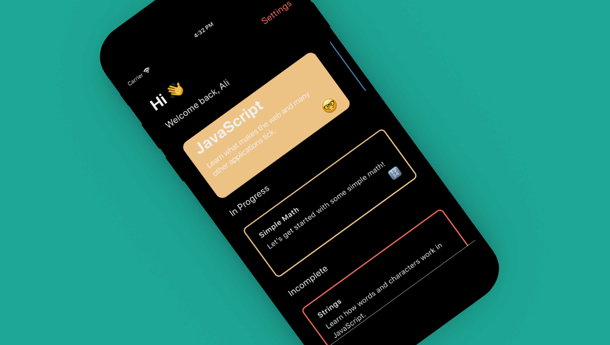
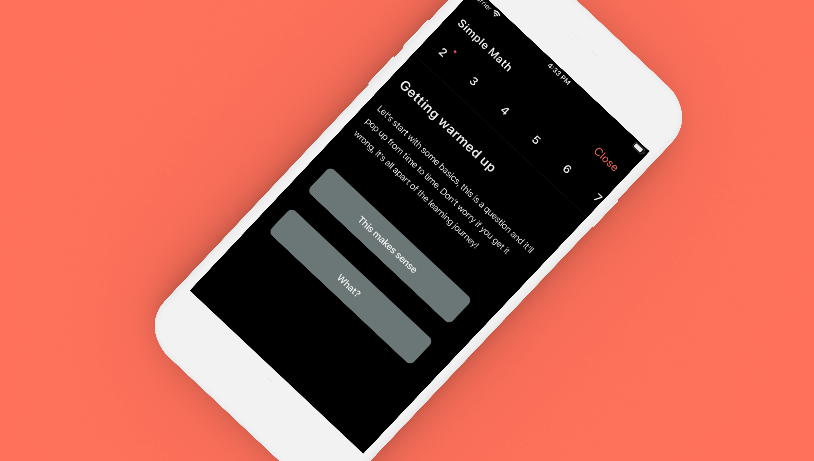
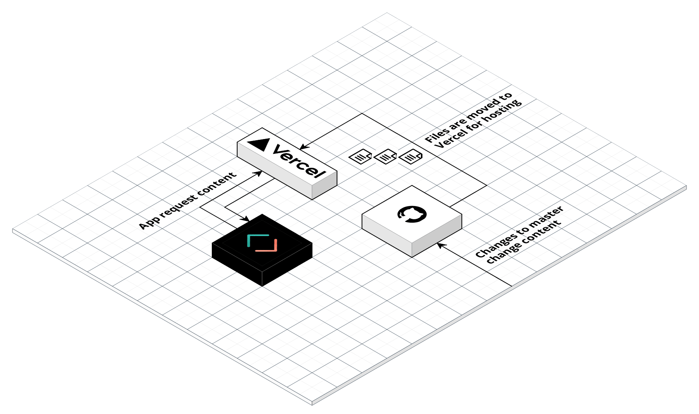

I've always wanted to teach programming to others just so that they can understand what it takes to build something in our modern generation.
Most of the time, it’s hard to explain some of the technical challenges I tackle every day on the job when talking to my friends, family or even my own fiancée. So, I decided to create Cursor—an app to help others understand some of the inner workings of programming without any barriers to entry.

## No Barriers?

A lot of people don't know this, but a lot of the knowledge I've learned over the years regarding software development has come from free resources available online. Whenever I needed help or a solution for a problem I would just Google it, and millions of free articles would come up to help me move forward. Now, if someone wants to learn programming, the options on the App Store are very limited. Some have paid tiers, bad data collection policies or even an undesirable design.

So, when I set out to create Cursor, I wanted to provide the same experience as a Google search (but without the data collection 😉) .**meaning no barriers to start!** Just enter your name (could be fake, I don't care as the info isn't stored anywhere except your device) and start learning. Most importantly, to prove that I’m not collecting any data whatsoever, Cursor is and always will be **free** and **[open source](https://github.com/awaseem/cursor)**.

## Design

I've always been fascinated with making beautiful applications. Now beauty is in the eye of the beholder, and I like to think that the products I make are very aesthetically pleasing (but I’d love to know your thoughts because I’m biased, of course). I wanted to make Cursor for people who have zero experience in programming and just want to learn the fundamentals. Not only does this mean simpler ways to verify information, but also simpler language presented to you!

First, I wanted the app to feel good. Scrolling should be smooth, animations should be playful without impeding your progress, and wording should be clear and helpful.

When it came to Cursor’s interface, I wanted there to be a single home screen; transitions to content would be done through modals. This would limit the number of options to the user so that they can focus on the content. You'll also notice the buttons to transition you from one course to another requires you to press the button down for a quick second before the app proceeds to the next screen. You might be asking, “Why must you make us wait a whole second before we can move onto the next screen? Why isn’t there just a simple button press?” I debated this for quite some time, but I always felt that a slightly prolonged button press would ensure that the user is atleast reading some content before frantically pressing the “Next” button and moving on. I know some people may find this annoying, so in the future I might add an option to toggle this off.

The wording of the content is always the most difficult part for me. I've been known to have the worst spelling of all time, so I'm sorry if any of those issues pop up 🙈.Also why so many emojis on Cursor? Because emojis show emotion (and they’re fun)! More importantly, it's a way to keep the interaction between the developer and the user’s thoughts at the same level. It might not work all the time, but it atleast presents the information in a more digestible way to the user.

## Data

I tried to keep this as simple as possible. Essentially, all of the course files for Cursor live within a Github repo called [Teacher](https://github.com/awaseem/teacher). Any changes to `master` will trigger a redeploy within [vercel](https://vercel.com/) that hosts the data files. Cursor calls these files like any other API, parses them and then presents the content. This way if I need to change anything related to the courses or content, I just make a small commit into master and—boom—everything is redeployed. The best part is this costs me **zero dollars** and gets me a bunch of added features like caching and worldwide CDN support. You can view the data here: [teacher.getcursor.app](https://teacher.getcursor.app)

## Future

The future is so bright. I will continue to work on Cursor to make it the best possible experience. If anything, I hope I've taught someone something new whether it be through Cursor, its code or even this post.

Thank you to everyone who has tried Cursor so far. I hope you are all enjoying it as much as I enjoyed making it! If you have a moment, I would love if you could rate it on the [App Store](https://apps.apple.com/ca/app/cursor/id1506865021). Learning should never have barriers, and I hope to continue to work on this until that statement is truly achieved.
