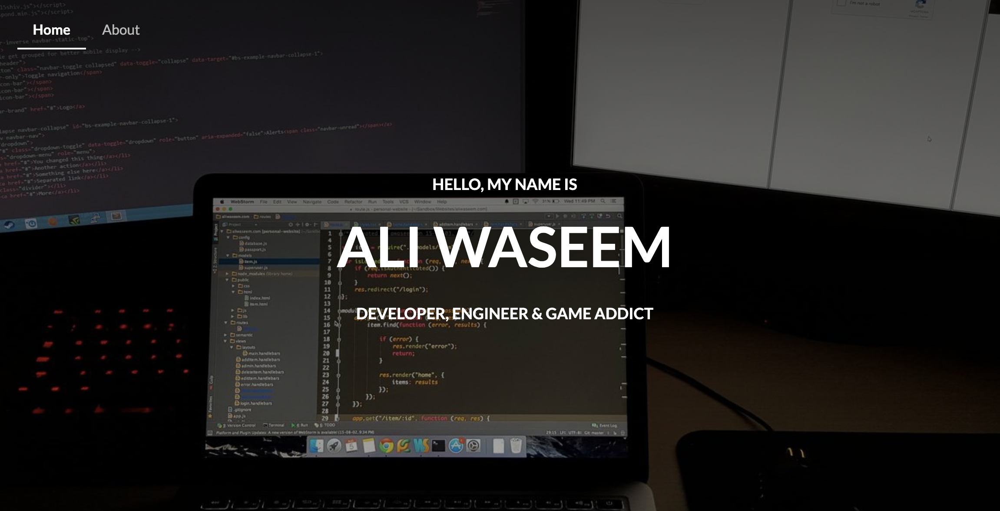
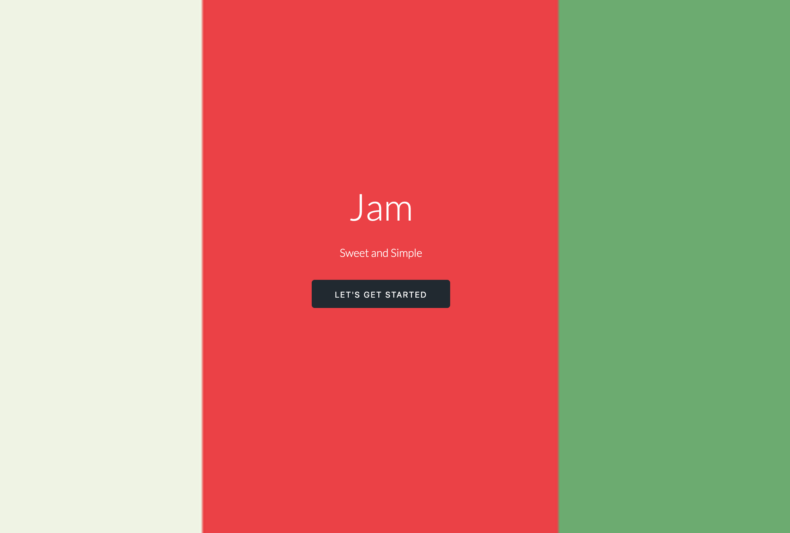
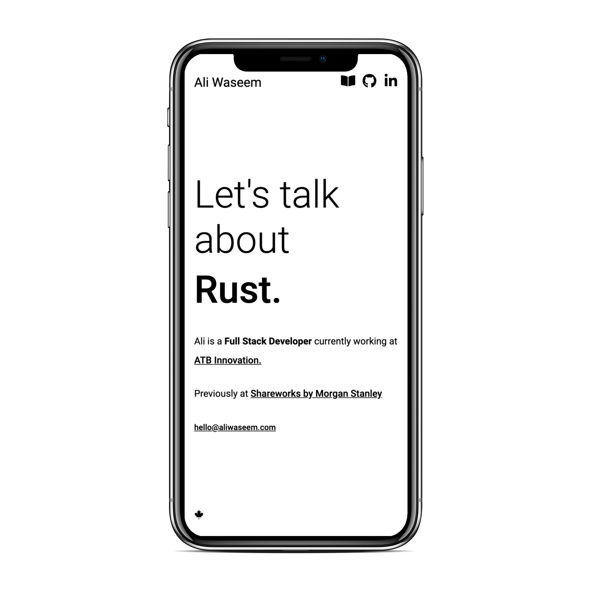
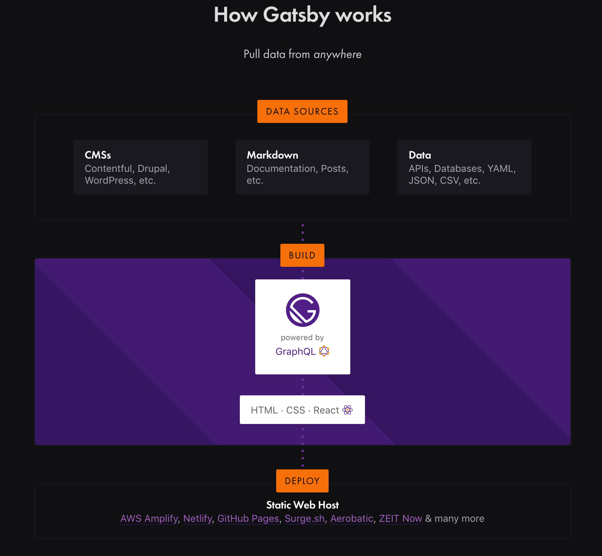

It's been a long time since I launched my website and even longer since I launched a personal blog. For me, I definitely lost touch on branding myself as an individual and my talents. Heck, the last time I updated my LinkedIn profile was in 2015 when I was just graduating university.

It took me sometime to really understand how important a personal brand really is! The way you present yourself to others can be your biggest asset to showcase your talent.

With this new website, I want to do just that&mdash;showcase my new, minimal website and compare its branding vs. my past personal websites.

## 2015: Starting my career



2015 was a weird time. I was just finishing up my internship at [Pason Systems](https://www.pason.com/) and trying my best to create a portfolio that would help start my career; but, to showcase my talent I needed a website.

When I asked my peers what I should do, they all told me to do a simple [jekyll](https://jekyllrb.com/) starter and work my way up from there. But being the "bright," "young" and "reinventing wheel" developer I was, I decided to create my own...**with a full CMS system built from scratch.**

This website was massive and it had every web framework/library under the sun. Semantic UI, jQuery, Express.js, etc...

Seriously, just look at this dependency list:

```json
...
  "dependencies": {
    "bcrypt-nodejs": "0.0.3",
    "better-console": "^0.2.4",
    "body-parser": "^1.13.3",
    "connect-flash": "^0.1.1",
    "cookie-parser": "^1.3.5",
    "del": "^1.2.0",
    "express": "^4.13.1",
    "express-handlebars": "^2.0.1",
    "express-session": "^1.11.3",
    "extend": "^3.0.0",
    "gulp-autoprefixer": "^2.3.1",
    "gulp-chmod": "^1.2.0",
    "gulp-clone": "^1.0.0",
    "gulp-concat": "^2.6.0",
    "gulp-concat-css": "^2.2.0",
    "gulp-copy": "0.0.2",
    "gulp-flatten": "^0.1.0",
    "gulp-header": "^1.2.2",
    "gulp-help": "^1.6.0",
    "gulp-if": "^1.2.5",
    "gulp-less": "^3.0.3",
    "gulp-minify-css": "^1.2.0",
    "gulp-notify": "^2.2.0",
    "gulp-plumber": "^1.0.1",
    "gulp-print": "^1.1.0",
    "gulp-rename": "^1.2.2",
    "gulp-replace": "^0.5.3",
    "gulp-rtlcss": "^0.1.4",
    "gulp-uglify": "^1.2.0",
    "gulp-util": "^3.0.6",
    "gulp-watch": "^4.3.4",
    "inquirer": "^0.9.0",
    "map-stream": "0.0.6",
    "mongoose": "^4.1.0",
    "passport": "^0.2.2",
    "passport-local": "^1.0.0",
    "require-dot-file": "^0.4.0",
    "semantic-ui": "^2.0.7",
    "session-file-store": "0.0.17",
    "winston": "^1.0.1",
    "yamljs": "^0.2.3"
  }
...
```

This was an overkill to make something so simple. It took way too much time, but you know what? I loved and learned a lot from this project. It taught me that no matter how small each project may seem, it can balloon to new heights, and **every dependency that solves a single problem might prop up 10 more.** Of course, in hindsight, it would have been much easier to just take something off the shelf, but the learnings were well worth the time and effort.

The design, on the other hand, does not hold up in any way. First of all, **I don't know why I thought it would be a good idea to a take a picture of my desk with two different text editors as my header image**. I guess it showcased my "elite" programming ability, or whatever I was thinking at the time. The worst part is that this picture is still my LinkedIn cover photo (well at least at the time of this blog post).

Also, the hover state doesn't make sense on any of the portfolio items. Why show the title again when hovering over an item? Like the item's name is already visible...

But even after 4 years, I was extremely proud of what I made. If you want to see what it looks like, you can check it out on [Wayback Machine](https://web.archive.org/web/20150927214543/http://aliwaseem.com/) and view all the source code on [Github](https://github.com/awaseem/aliwaseem.com).

## 2016: Age of React



2016 was a great year for me. I just relocated to Los Angeles to work at [GoGuardian](https://www.goguardian.com/), a company that was developing on a more modern development stack. **This was where my career really sky rocketed.** All my peers challenged me to think outside the box and bring solutions to problems that I would have never encountered in Calgary at that time. So with all these new skills under my belt, it was time to redesign my brand, except this time I decided to something a bit different (spoiler: I ended up creating a CMS system again 🙃).

At this point, I had given up on templating with [HandlerBars.js](https://handlebarsjs.com/) to fully embrace client-side rendering with the use of [React.js](https://reactjs.org/). I didn't want to just recreate my website using React, and looking back, I never even intended to create a personal website again. Instead I wanted to design a standalone component library using React's biggest strength: **component-based user interfaces.**

The inspiration came from GoGuardian's own internal component library (obviously with very different component designs). My spin on it was that going forward if I needed to build a web application, I could reuse components from my own personal library vs. rewriting everything from scratch. Now, this was the time where [Storybook.js](https://storybook.js.org/) was gaining popularity, but unfortunately flew under my radar when I embarked on this project (I did end up implementing a Storybook.js based component library with React, but that can be another blog post).

I based my component library on [Skelton.css](http://getskeleton.com/) for the design and [Anime.js](https://animejs.com/) for animations. In the end, I created [Jam](https://awaseem.github.io/Jam/). Now **I would not recommend using Jam**, as it's horribly out of date and I have no idea how well it still integrates into new React projects. Once I had finished creating the library, I didn't know what else I was going to build with it. So just to test out the components, I decided to build a redesigned personal website. **The sad thing is that I only ever used Jam for my personal site and then quickly abandoned it.**

I liked the design of this website. It was still similar to my previous one but with a bigger, higher resolution image. The buttons were clean and the typography was sharp yet readable. I do remember that the buttons within Jam had this obnoxious jump animation that I ended up disabling anyway. Now, as to why I added that jump animation in the first place: 🤷.


And yes, I did end up creating another CMS system that talked to a Go-based Redis wrapper exposed through a REST api named [Blob](https://github.com/awaseem/blob), and an auth service that I created in Go as well called [JWTea](https://github.com/awaseem/JWTea). The idea behind these services was similar to Jam; it was going to be used more than once for other projects. Sadly like Jam, they were only used for my personal website. Even with all that work, I realistically only ended up updating the website maybe twice. That was obviously overkill for a personal website...but hey, at least it was a learning opportunity.

Unfortunately you can't view the website on Wayback Machine, but all the source code is still on [Github](https://github.com/awaseem/aliwaseem.com-redesign).

## 2019: Rebranding



So after starting my career and building these platforms for my personal brand, why take such a long break? Well, life happened! I moved back to Calgary to work for Solium (a.k.a. [Shareworks by Morgan Stanley](https://www.shareworks.com/)). At this point, I never updated anything online related to my career. Slowly, all my projects had their domains expired, and my LinkedIn hadn't changed since 2015 (except for adding new roles). Personally the changes I was making within Solium was so interesting for me that I didn't really focus on my external image. I'm extremely proud of all the things I accomplished in my career at Solium, but my apathy towards my external image still bothered me. If people were to look me up, they would receive a brand of myself from the past.

Now we've come to Thanksgiving 2019 (Canadian Thanksgiving), where I couldn't let that thought exist. I decided to recreate a new platform that is more than just a website to showcase my talent. This is where the adventure began and it's completely different than my older websites. I was heavily inspired by [OverReacted.io](https://overreacted.io/) by [Dan Abramov](https://mobile.twitter.com/dan_abramov) and also wanted to add a blog component, where I could share my thoughts about development, life lessons and everything in between. This is why I created [aliw.ca](https://aliw.ca), an clean and minimal design that showcases my skills with a built-in blog to highlight my opinions on anything.

### Gatsby.js



I knew for a fact that I didn't want to create another CMS myself or go crazy with the design. This new website uses [Gatsby.js](https://www.gatsbyjs.org/), a relatively new framework for creating static websites. Working with Gatsby this weekend has been amazing! Basically everything that relates to static sites from server-side rendering, content management and SEO has been abstracted from you via plugins that you can install. You still write all the front-end with React and you can use GraphQL to query data from any data source. A data source can be something as simple as a markdown page within your Github repo, complex APIs, or CMS systems. Once the queries are written, everything is fetched in build time which generates static files that you can host anywhere!

It's this idea of fetching data at _build time_ rather than _run time_ which makes Gatsby so unique (of course you can still make API calls when the components are mounted at run time). It makes sense to gather data when building all the assets for content that isn't going to change all that often. I'm also a huge fan of the [gatsby-remark-images](https://www.gatsbyjs.org/packages/gatsby-remark-images/?=gatsby-remark-images) plugin. This is what allows my images to blur in when they're fully loaded. Implementing this on my on would take quite a long time, but with Gatsby it's as simple as installing the plugin and adding it to a config file.

When I need to write new content for the blog, I simply add a markdown page within the `content` folder and Gatsby will generate a new static page on build time. When I push the new changes to master, it builds all the assets and automatically deploys all content with [now.sh](https://now.sh). **It's that simple**. No more creating complicated CMS systems and admin panels with everything being managed through Git and Github.

### Design

When I set out to create a new website, I wanted the design to be unique and completely different than what I've done in the past. That's why the whole website has no colour and only text with some light icon usage. Even though I had no colours to choose from, I still wanted the reader's attention. I accomplished that with the use of fade-in style animations. These animations give the idea that this website is alive vs. simple black text on a white page.

Compared to my previous websites, this one does not have a dedicated section for my personal projects. This time around I really wanted to showcase my skills. I wanted to present them in a minimal, but digestible way. The approach I took was to create this rotating text that randomly picks any one of my skills and presents it to the user. It's small, but once the text starts rotating, it grabs the reader's attention directly to the centre of the page to see what other skills will pop up.

## Closing thoughts

I've had quite a journey creating personal websites to showcase my brand. This design is the one I'm most happy about; it's clean and does a great job of showcasing the developer I am vs. the developer I was. I hope you enjoyed reading my journey. I'll be doing more of these posts in the future about various other aspects of my life above beyond the scope of development. Thanks again and feel free to [connect.](https://ca.linkedin.com/in/waseema393)
