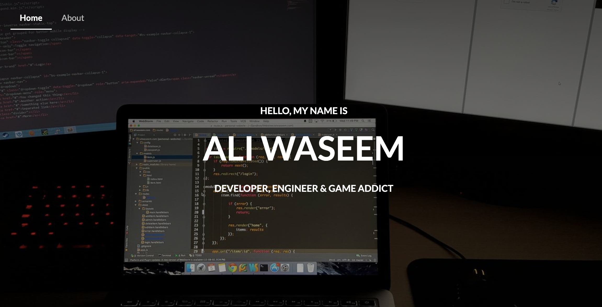

It's been a long time since I launched my website and even longer since I've launched a personal blog. I think for me I defenitly lost touch on branding myself as an individual and my talents. Heck the only time I updated my Linkedin was in 2015 when I was just graduting university.

It took me sometime to really understand how important personal brand is! The way you present youself to others can be your biggest asset to showcase your talent.

With this new website I want to do just that, show case a new minimal website and compare it's branding vs. my personal websites of the past.

## 2015: Starting a career

<br />



2015 was a weird time. I was just finishing up my internship and trying my best to create a portfolio that would help me start my career, but to showcase my talent I needed a website.

When I asked my peers on what to do, they all just asked to do a simple [jekyll](https://jekyllrb.com/) starter and work my way up from there, but being the 'bright', 'young' and 'reinventing' wheel' developer I was, I decided to create my own.... **With a full CMS system built from scratch.**..

This website was massive and it had every webframe/library under the sun as dependency. Semantic UI, jQuery, Express.js, etc...

Serisouly just look at this dependency list:

```json
...
  "dependencies": {
    "bcrypt-nodejs": "0.0.3",
    "better-console": "^0.2.4",
    "body-parser": "^1.13.3",
    "connect-flash": "^0.1.1",
    "cookie-parser": "^1.3.5",
    "del": "^1.2.0",
    "express": "^4.13.1",
    "express-handlebars": "^2.0.1",
    "express-session": "^1.11.3",
    "extend": "^3.0.0",
    "gulp-autoprefixer": "^2.3.1",
    "gulp-chmod": "^1.2.0",
    "gulp-clone": "^1.0.0",
    "gulp-concat": "^2.6.0",
    "gulp-concat-css": "^2.2.0",
    "gulp-copy": "0.0.2",
    "gulp-flatten": "^0.1.0",
    "gulp-header": "^1.2.2",
    "gulp-help": "^1.6.0",
    "gulp-if": "^1.2.5",
    "gulp-less": "^3.0.3",
    "gulp-minify-css": "^1.2.0",
    "gulp-notify": "^2.2.0",
    "gulp-plumber": "^1.0.1",
    "gulp-print": "^1.1.0",
    "gulp-rename": "^1.2.2",
    "gulp-replace": "^0.5.3",
    "gulp-rtlcss": "^0.1.4",
    "gulp-uglify": "^1.2.0",
    "gulp-util": "^3.0.6",
    "gulp-watch": "^4.3.4",
    "inquirer": "^0.9.0",
    "map-stream": "0.0.6",
    "mongoose": "^4.1.0",
    "passport": "^0.2.2",
    "passport-local": "^1.0.0",
    "require-dot-file": "^0.4.0",
    "semantic-ui": "^2.0.7",
    "session-file-store": "0.0.17",
    "winston": "^1.0.1",
    "yamljs": "^0.2.3"
  }
...
```

All this was extremely overkill to make something so simple and it took way to much time, but you know what? I loved and learned a lot from this project. It thought me that no matter how small each project may seem, it can balloon to new heights, and **every dependency that solves a single problem might prop up 10 more.** Of course in hindsight it would have been much easier to just take something of the shelf, but the learnings were well worth the time and effort.

The design on the other hand does not hold up in anyway. First of all I don't know why I thought it would be a code idea to a take a picture of my desk with two text editors open on two different computers. I guess it showcased my 'elite' programming ability, or whatever I was thinking at the time. The worst part is that, this picture is still my linkedin cover photo (well at least at the time of this blog post), the same picture of 4 years.

Also the hover state doesn't make sense on any of my portfolio items, why show the title again when hovering of the item? Like the items name is already visible...

Anyway after 4 years I was extremely proud of what I made, and if you want to see what it looks like check it out on wayback machine [here](https://web.archive.org/web/20150927214543/http://aliwaseem.com/)
